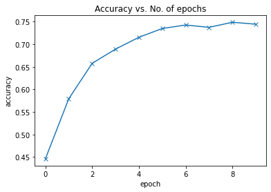

# CIFAR10 Image Classification using CNN with PyTorch

 

## About

This repository contains a custom CNN trained on CIFAR-10 dataset. This model achieves a Training accuracy of 74.46% and a test accuracy of 74.31%.

## Next Steps

1. Try chaging the hyperparameters to achieve a higher accuracy within fewer epochs.
2. Try adding more convolutional layers, or increasing the number of channels in each convolutional layer
3. Try using a feedforward neural network and see what's the maximum accuracy you can achieve
